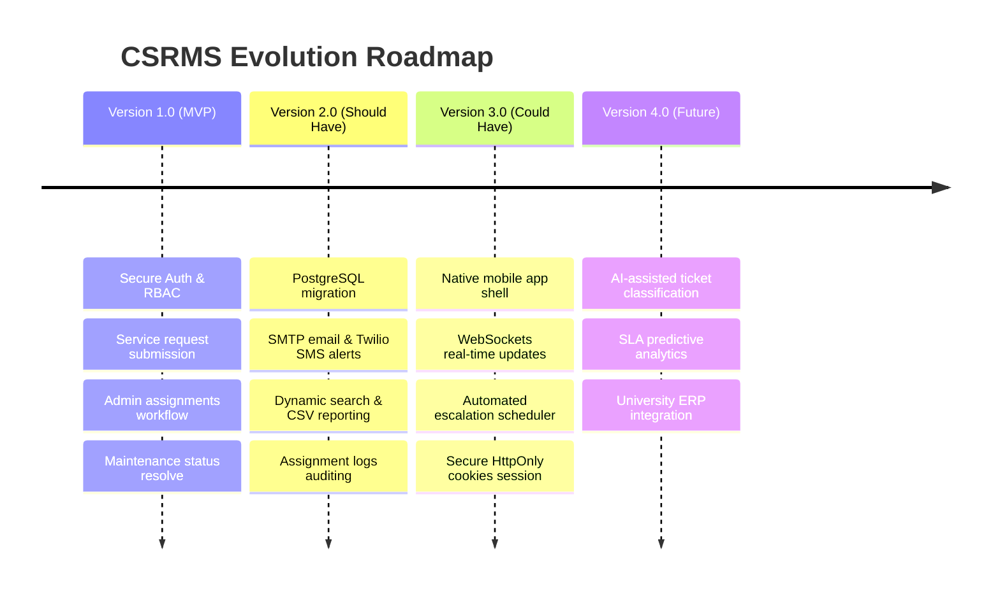

# Software Maintenance Strategy & Future Evolution Plan
## Campus Service Request Management System (CSRMS)

---

### 1. Software Maintenance Strategy
A comprehensive post-release maintenance plan is critical to preserve system stability, security, and performance. We categorize our maintenance strategy into the four standard IEEE software engineering categories:

#### A. Corrective Maintenance (Defect Mitigation)
* **Goal:** Rectify errors and defects discovered by campus users during active operations.
* **CSRMS Application Specifics:**
  - Fixing state transition edge-cases (e.g., if a user manages to request status update to `CLOSED` without going through `RESOLVED`).
  - Repairing broken links or rendering failures on specific mobile browser versions.
  - Mitigating database concurrency conflicts when multiple admins save assignments simultaneously.

#### B. Adaptive Maintenance (Environmental Compliance)
* **Goal:** Modify the application to conform to changes in external execution environments, database systems, or API library changes.
* **CSRMS Application Specifics:**
  - Upgrading dependencies (e.g. FastAPI, Pydantic V2 migrations, SQLAlchemy 2.x security releases).
  - Updating CORS headers if the frontend is hosted on a separate subdomain from the API.
  - Adjusting to SQLite system upgrades or migrating to PostgreSQL on cloud environments.

#### C. Perfective Maintenance (Performance & Quality Improvement)
* **Goal:** Introduce new features, optimize execution paths, and enhance usability based on active user feedback.
* **CSRMS Application Specifics:**
  - Adding search fields to tables so admins can quickly filter by room name or requester email.
  - Caching category tables in Redis to minimize database read queries.
  - Improving styling details (e.g. adding smooth skeleton loaders during API fetch operations).

#### D. Preventive Maintenance (Technical Debt & Code Refactoring)
* **Goal:** Inspect code structure, optimize layout, and document classes to improve maintainability and avoid future defects.
* **CSRMS Application Specifics:**
  - Refactoring massive service functions into smaller class utilities.
  - Reviewing dependency injection modules to avoid circular imports.
  - Extending automated test coverage to target higher line-coverage percentages.

---

### 2. Multi-Phase Future Evolution Plan

The roadmap below maps the expansion of CSRMS over subsequent releases:

#### Detailed Phase Roadmaps:
1. **Version 2.0 (Performance & Integration):**
   - **PostgreSQL Database:** Replace SQLite with PostgreSQL for multi-node deployments.
   - **Notifications Gateways:** Connect SendGrid for email updates and Twilio for urgent priority SMS alerts.
   - **Audit Logs:** Add historical tracking tables showing every assignment transition.
2. **Version 3.0 (Real-Time & Accessibility):**
   - **WebSockets integration:** Push real-time status counts to admin dashboards without requiring manual browser reloads.
   - **Mobile Client:** Package the frontend files into a Capacitor or Cordova app shell for native mobile execution.
   - **Automated Escalation:** System schedules checks; if a ticket is `URGENT` and remains `SUBMITTED` for more than 4 hours, it triggers automatic escalation to supervisor.
3. **Version 4.0 (Intelligent Diagnostics):**
   - **AI-Based Categorization:** Natural language processing reads requester description text and auto-assigns category and priority.
   - **Predictive Maintenance:** Analyze ticket frequency in specific locations to schedule preventive maintenance checks.

---

### 3. Layered Architecture: Decoupling and Flexibility
The layered architecture chosen for CSRMS simplifies post-release maintenance and evolutionary upgrades:
- **Database Decoupling:** Repositories abstract all database queries. If we migrate from SQLite to PostgreSQL, we only modify connection strings in `app/config.py` and `app/database.py`. The service layer (`RequestService`) remains untouched.
- **Frontend Decoupling:** The API routes exchange clean JSON schemas. We can replace our Vanilla HTML/JS frontend with a React or Next.js app without altering a single line of Python backend service code.
