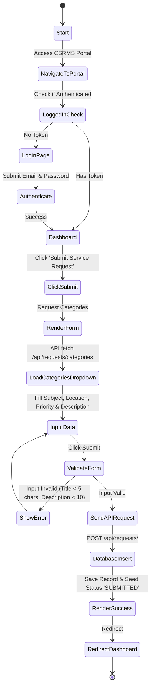
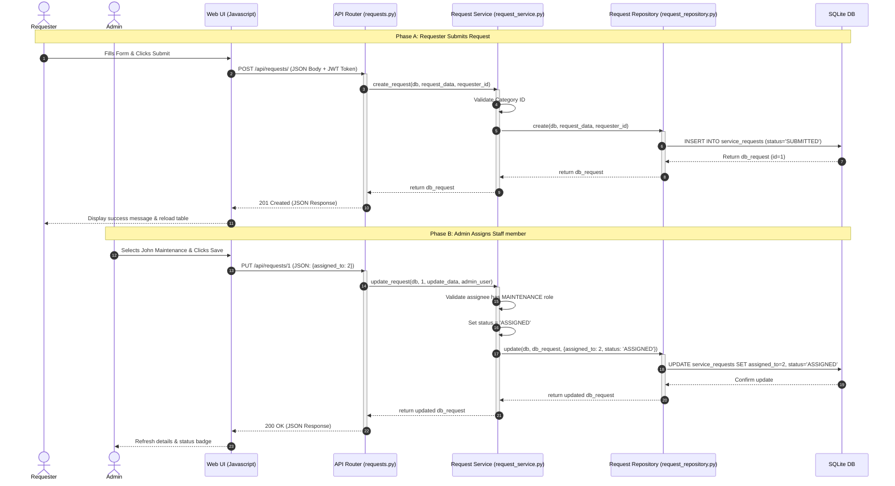
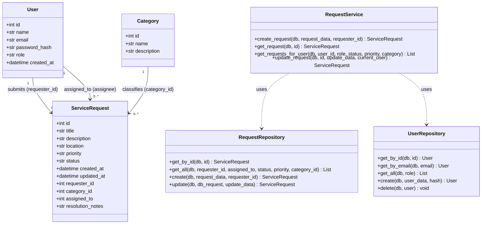
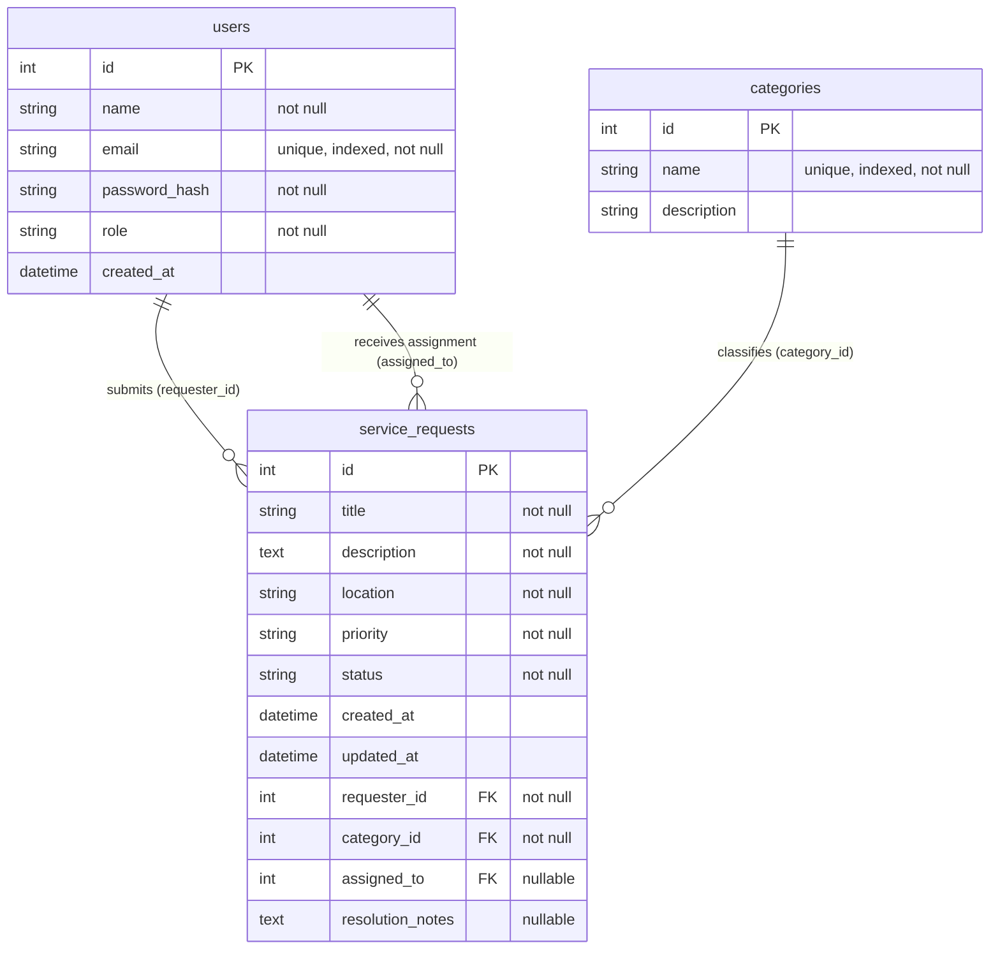
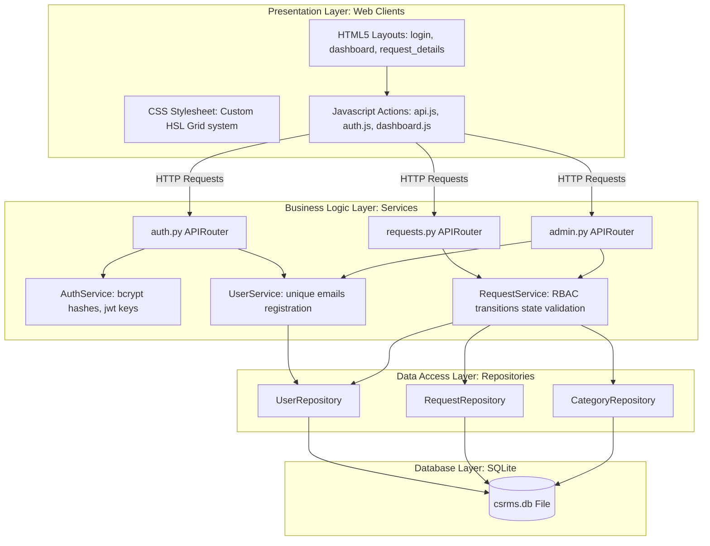

# System Design & UML Diagrams
## Campus Service Request Management System (CSRMS)

This document provides system design diagrams representing the architecture, database schema, use cases, and workflows implemented in the CSRMS project.

---

### 1. Use Case Diagram
This diagram outlines the interactions between our three actors (Requester, Administrator, and Maintenance Staff) and the core use cases.

```mermaid
usecaseDiagram
    rect "Campus Service Request Management System (CSRMS)"
        usecase UC_Register "Register Account"
        usecase UC_Login "Login Authentication"
        usecase UC_Submit "Submit Service Request"
        usecase UC_ViewOwn "View Personal Requests"
        usecase UC_Close "Close Resolved Request"
        usecase UC_ViewAll "View All Campus Requests"
        usecase UC_Assign "Assign Staff to Request"
        usecase UC_Prioritize "Prioritize Request"
        usecase UC_DeleteUser "Delete User Account"
        usecase UC_Stats "View Dashboard Stats"
        usecase UC_ViewAssigned "View Assigned Tasks"
        usecase UC_Progress "Update Progress (In Progress)"
        usecase UC_Resolve "Resolve Request (with Notes)"
    end

    actor Requester
    actor Administrator
    actor "Maintenance Staff" as Staff

    Requester --> UC_Register
    Requester --> UC_Login
    Requester --> UC_Submit
    Requester --> UC_ViewOwn
    Requester --> UC_Close

    Administrator --> UC_Login
    Administrator --> UC_ViewAll
    Administrator --> UC_Assign
    Administrator --> UC_Prioritize
    Administrator --> UC_DeleteUser
    Administrator --> UC_Stats

    Staff --> UC_Login
    Staff --> UC_ViewAssigned
    Staff --> UC_Progress
    Staff --> UC_Resolve
```

---

### 2. Activity Diagram (Submit Service Request)
The following activity diagram traces the workflow of a Requester submitting a maintenance ticket:



---

### 3. Sequence Diagram (Request Creation & Assignment Flow)
This diagram illustrates the message passing sequence across the Presentation, Logic, and Data layers when a Requester submits a request and an Admin assigns it to staff.



---

### 4. Class Diagram
The class diagram represents the structure of our core business objects, services, repositories, and relationship mappings.



---

### 5. Entity-Relationship (ER) Diagram
This diagram outlines the physical database schema, data types, indexes, and constraints implemented in SQLite.



---

### 6. Layered Architecture Diagram
This diagram shows the structural layers of our application code, mapping the code modules to their layer boundary responsibilities.


